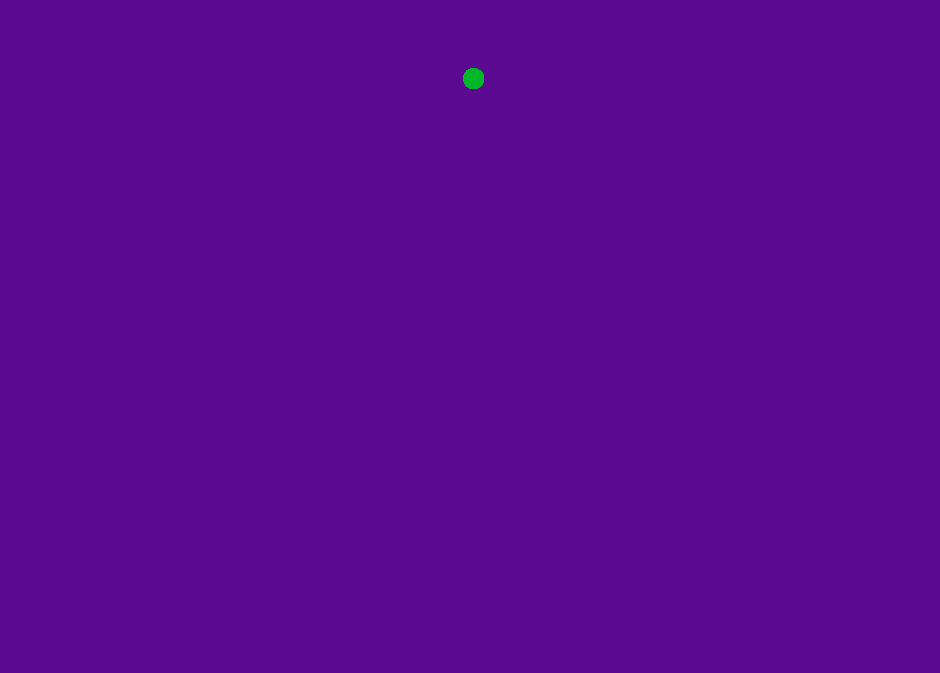

# SDL2-Emscripten-project-template

A C++ project template using the SDL2 & Emscripten libraries. This template will allow you to:

1. Build and run your own video game on your machine (with the use of CMAKE) 
2. Build and run your own video game in a browser (with the use of CMAKE)
3. Serve your game to the browser - using python httpserver for simplicity
4. Debug and inspect your video game using vscode thanks to the bundles settings in .vscode

A live example can be run here [Click me!](http://ex2.jim.wales/)


 

## Supported platforms

|  Platform         |  Status   |
| ----------------- | --------- |
| Windows - MingGW  |   ✔️      |
| Windows - MSVC    |   ✔️      |
| OSX               |   ✔️      |
| Browser - Emscripten  | ✔️   |
| Browser - Emscripten (with docker) | ✔️   |

This project comes with a barebone example that just renders a circle that moves up and down.

It has a common video game flow:

_Pseudocode_
```
 > initialize
 
 > Game loop
     -> update state
     -> render
     -> input

 -> exit/cleanup
```

## Cloning: 

Through CLI: 

```
git clone https://github.com/Reesy/sdl2-emscripten-project-template
```


Graphically (this will also generate a project on your profile) 


## Building: 
This project has a dependency on SDL2 and SDL_image (which I have bundled under /libs) but can be found at libsdl.org.

<dl>
    <dt> Requirements<dt>
    <dd style='color:red'> CMake -- required to build this project </dd>
<dl>

To build a Visual Studios project (the .vcxproj file will be placed in the sdl2-emscripten-project-template/build folder)

```
cmake . -B build
```
    
To build a release on OSX or MinGW (if using ```-G "MinGW Makefiles"```):

```
cmake . -B build
make
```

To build for browser with Emscripten (requires emscripten installed and on the path): 

```
emcmake cmake . -B build 
 
cd build && make
```

To build with debug symbols (on OSX):
```
cmake -DCMAKE_BUILD_TYPE=Debug . -B build
make
```

<div style='color:red'> The 'resources' folder needs to exist in the same directory as the .exe file (on OSX it will be automatically bundled into the app</div>


## Manual building without CMake    

Manually building with MinGW for 32bit:

```
g++ ../src/main.cpp -o testApp \
    -I ../libs/mingw/SDL2-2.0.14/i686-w64-mingw32/include/SDL2  \
    -I ../libs/mingw/SDL2_image-2.0.5/i686-w64-mingw32/include/SDL2 \
    -L ../libs/mingw/SDL2-2.0.14/i686-w64-mingw32/lib/ \
    -L ../libs/mingw/SDL2_image-2.0.5/i686-w64-mingw32/lib/ \
    -lmingw32 -lSDL2main -lSDL2 -lSDL2_image
```

Manually building with emscripten
```
emcc src/main.cpp -s WASM=1 -s USE_SDL=2 -s USE_SDL_IMAGE=2 -O3 -o index.js
```
    
    
## Building and hosting on the web
 
_This will create a make file and copy a basic index.html and python script to the embuild folder_
``` 
emcmake cmake -B embuild . 
cd embuild && make
``` 
Serving the file using httpserver with Python 2: ```python -m SimpleHTTPServer 8080``` 

## Hosting with docker  
### Building the image 
_The emscripten build must me run first_

```
emcmake cmake -B embuild . 
cd embuild && make
docker build -t <desired_image_name> .
``` 
 
### Running the image
```
docker run --name <desired_container_name> -p <desired_port>:3000 <desired_image_name> 
```

You will then be able to view the application on ```http://localhost:<desired_port>``` i.e http://localhost:3000
 
## Debugging
    
This project comes with a .vscode folder prebundled to make debugging easier, for this to work two plugins are necessary 

<dl>
    <dt> Recommended Plugins<dt>
    <dd style='color:green'>C/C++ Plugin </dd>
    <dd style='color:green'>CodeLLDB* </dd>
<dl>

\*CodeLLDB is only recommended for debugging on modern OSX versions

SDL2 can be found https://www.libsdl.org/

 


Credit for the code in main from: 
    1. http://main.lv/writeup/web_assembly_sdl_example.md#toc-1   
    2. https://www.willusher.io/sdl2%20tutorials/2013/08/27/lesson-5-clipping-sprite-sheets 

Used httplib: 
https://github.com/yhirose/cpp-httplib
